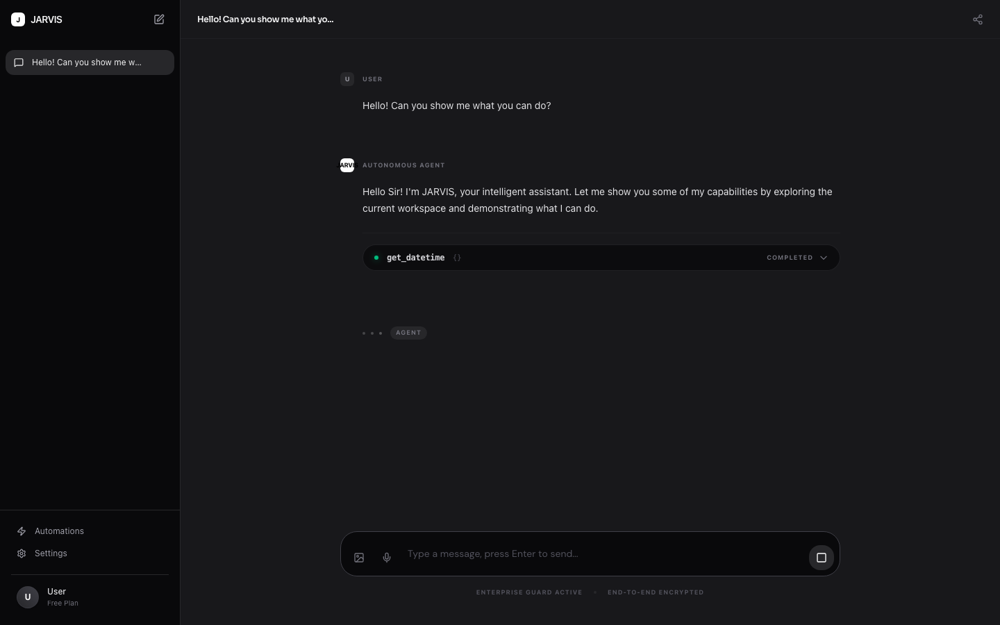
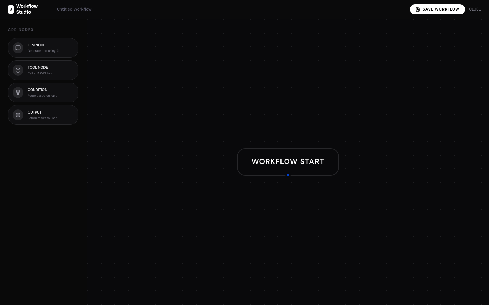
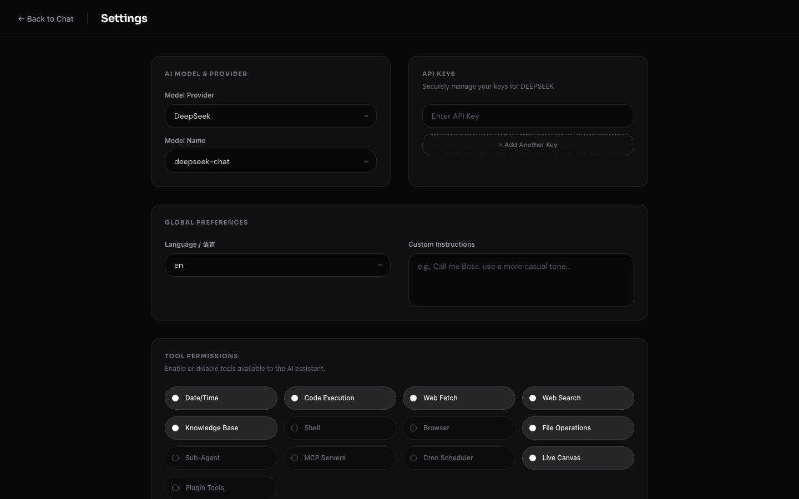

[中文](docs/i18n/zh/README.md) | [日本語](docs/i18n/ja/README.md) | [한국어](docs/i18n/ko/README.md) | [Français](docs/i18n/fr/README.md) | [Deutsch](docs/i18n/de/README.md)

# JARVIS

> A self-hosted AI assistant platform with RAG, multi-channel messaging, sandboxed tool execution, multi-tenant workspaces, and full observability — one `docker compose up` away.

[](LICENSE)
[](https://github.com/hyhmrright/JARVIS/releases)
[](https://github.com/hyhmrright/JARVIS/actions/workflows/ci.yml)
[](https://www.python.org)
[](https://vuejs.org)

## Screenshots

| Chat + Tool Calls | Workflow Studio |
|:-----------------:|:---------------:|
|  |  |

| Settings | Skill Market |
|:--------:|:------------:|
|  |  |

## Features

### AI & Agents
- **Multi-LLM with Failover** — DeepSeek · OpenAI · Anthropic · Zhipu GLM; configurable fallback chains with transparent retries
- **LangGraph ReAct Agent** — Tool-calling agent with web search, code execution, file I/O, shell, browser, datetime, and RAG tools
- **Multi-Agent Supervisor** — Routes complex tasks to specialized expert agents (code / research / writing); non-expert tasks go to the standard ReAct graph
- **Visual Workflow Studio** — Node-based editor for designing multi-step AI workflows compiled to LangGraph at runtime
- **Skill Market** — Discover and install agent skills from remote registries with 1-click deployment
- **Personas** — Custom system-prompt profiles; select at conversation start to control AI behavior and tone

### Knowledge & Context
- **RAG Knowledge Base** — Upload PDF / TXT / MD / DOCX with sliding-window chunking and vector indexing (Qdrant); one collection per user, one per workspace
- **Branching Conversations** — Tree-based message history; regenerate any AI reply and switch between branches with full context preservation
- **Context Compression** — Automatic LLM-powered summarization when context window approaches limits

### Integrations & Automation
- **Multi-Channel Messaging** — Unified adapter layer for Slack, Discord, Telegram, Feishu, and WhatsApp; add new channels without touching the agent core
- **Cron Jobs + Trigger System** — Schedule agents on a cron; trigger on web content change, semantic similarity match, or incoming email
- **Webhooks** — Inbound webhook endpoints deliver payloads directly to agents with automatic retry logic
- **MCP Servers** — Connect any Model Context Protocol server as a tool source at runtime

### Platform & Security
- **Multi-Tenant Organizations** — Organizations → Workspaces → Members hierarchy; isolated RAG collections and settings per workspace
- **Personal Access Tokens** — `jv_`-prefixed API keys; scoped (`full` / `readonly`), expirable, hashed at rest
- **Audit Logs** — Tamper-evident log of all auth events, admin actions, and API key usage
- **Per-User Rate Limiting** — Configurable request caps; input sanitization on all user content
- **Public Sharing** — Generate read-only public links for sharing conversations

### Interface & UX
- **Live Canvas** — Stream ECharts visualizations and interactive forms into the sidebar alongside Markdown
- **Voice Input/Output** — TTS and STT support with multiple neural voices for hands-free interaction
- **LLMOps Dashboard** — Visual token consumption and model performance metrics via ECharts
- **Multilingual UI** — 6 languages: Chinese, English, Japanese, Korean, French, German

### Infrastructure
- **Sandboxed Tool Execution** — Browser and shell tools run in ephemeral Docker containers, fully isolated from the host filesystem and network
- **Production-grade Observability** — Traefik edge router, Prometheus + Grafana + Loki + Promtail stack, cAdvisor container metrics, 4-layer network isolation

## System Limitations (Sandbox)

JARVIS runs entirely inside Docker containers to ensure host safety.

- **No Host OS Access** — Cannot execute commands on your local machine (macOS, Windows, Linux).
- **No Native Package Managers** — Cannot run `brew install`, `apt-get`, or `npm install -g` on the host.
- **Isolated Execution** — All AI-executed commands (Python scripts, shell utilities) run inside the backend container or a dedicated sandbox container, fully isolated from the host OS.

## Tech Stack

| Layer | Technology |
|-------|------------|
| Backend | FastAPI · LangGraph · SQLAlchemy · Alembic · ARQ |
| Frontend | Vue 3 · TypeScript · Vite · Pinia · Tailwind CSS |
| Database | PostgreSQL · Redis · Qdrant (Vector DB) |
| Storage | MinIO |
| LLM | DeepSeek · OpenAI · Anthropic · Zhipu GLM |
| Edge Router | Traefik v3 |
| Observability | Prometheus · Grafana · Loki · Promtail · cAdvisor |

## Prerequisites

| Tool | Version | Install |
|------|---------|---------|
| Docker + Docker Compose | 24+ | [docs.docker.com](https://docs.docker.com/get-docker/) |
| uv | latest | `curl -LsSf https://astral.sh/uv/install.sh \| sh` |

> **Local development only** additionally requires [Bun](https://bun.sh) for the frontend.

## Quick Start

### 1. Clone and generate environment

```bash
git clone https://github.com/hyhmrright/JARVIS.git
cd JARVIS
bash scripts/init-env.sh
```

> Requires `uv` (used internally to generate the Fernet encryption key). No other setup needed.

### 2. Add your LLM API key

Open `.env` and fill in at least one key:

```
DEEPSEEK_API_KEY=sk-...      # https://platform.deepseek.com
OPENAI_API_KEY=sk-...        # optional
ANTHROPIC_API_KEY=sk-ant-... # optional
ZHIPUAI_API_KEY=...          # optional, https://open.bigmodel.cn
```

### 3. Start

```bash
docker compose up -d
```

First run builds the Docker images — allow a few minutes. Once healthy:

| Service | URL | Available |
|---------|-----|-----------|
| **App** | http://localhost | always |
| Grafana (monitoring) | http://localhost:3001 | always |
| Traefik dashboard | http://localhost:8080/dashboard/ | dev only |
| Backend API (direct) | http://localhost:8000 | dev only |

> The default `docker compose up -d` auto-merges `docker-compose.override.yml`, which exposes debug ports and enables hot-reload for backend code. For production, see below.

### Troubleshooting

**Services fail to start** — check logs:
```bash
docker compose logs backend
docker compose logs worker
docker compose logs traefik
```

**Rebuild from scratch** (after changing Dockerfiles or dependencies):
```bash
docker compose down
docker compose build --no-cache
docker compose up -d --force-recreate
```

**Port conflict on `:80`** — stop whatever holds port 80, then retry.

---

## Docker Compose Files

This project uses two compose files that work together:

| File | Purpose |
|------|---------|
| `docker-compose.yml` | **Base (production)** — minimal surface: only `:80` and `:3001` exposed |
| `docker-compose.override.yml` | **Dev overrides** — auto-merged by Docker Compose; adds debug ports, hot-reload |

Docker Compose automatically merges the override file when you run `docker compose up -d`, so **no extra flags are needed for local development**. For production, explicitly exclude it:

```bash
# Development (default) — merges both files automatically
docker compose up -d

# Production — base file only, no debug ports, no hot-reload
docker compose -f docker-compose.yml up -d
```

## Production Deploy

```bash
docker compose -f docker-compose.yml up -d
```

Exposed ports: `:80` (app) and `:3001` (Grafana) only.

---

## Local Development

Run backend and frontend natively for faster iteration.

**Step 1 — start infrastructure:**

```bash
docker compose up -d postgres redis qdrant minio
```

**Step 2 — backend** (new terminal, from repo root):

```bash
cd backend
uv sync
uv run alembic upgrade head
uv run uvicorn app.main:app --reload   # http://localhost:8000
```

**Step 3 — frontend** (new terminal, from repo root):

```bash
cd frontend
bun install
bun run dev   # http://localhost:3000  (proxies /api → localhost:8000)
```

---

## Project Structure

```
JARVIS/
├── backend/                    # FastAPI (Python 3.13 + uv)
│   ├── app/
│   │   ├── agent/              # LangGraph ReAct agent, LLM failover, persona, context compressor
│   │   ├── api/                # HTTP routes (auth/chat/conversations/documents/settings/
│   │   │                       #   cron/webhooks/voice/tts/canvas/organizations/workspaces/
│   │   │                       #   invitations/plugins/keys/admin/logs/usage/personas/
│   │   │                       #   public/workflows/gateway)
│   │   ├── channels/           # Channel adapters (Slack/Discord/Telegram/Feishu/WhatsApp)
│   │   ├── core/               # Config, JWT/bcrypt/Fernet security, rate limiting, audit log
│   │   ├── db/                 # SQLAlchemy async models (21 tables) + sessions
│   │   ├── gateway/            # Channel router + session manager + security
│   │   ├── infra/              # Qdrant / MinIO / Redis singletons
│   │   ├── plugins/            # Plugin SDK loader + SKILL.md parser
│   │   ├── rag/                # Document chunker + embedder + indexer + context builder
│   │   ├── sandbox/            # Docker-based ephemeral sandbox manager
│   │   ├── scheduler/          # Cron runner + trigger system (web/semantic/email watchers)
│   │   ├── services/           # Cross-cutting services (memory sync)
│   │   ├── tools/              # LangGraph tools (search/browser/shell/code_exec/file/rag/canvas)
│   │   └── worker.py           # ARQ background worker (cron execution, webhook delivery, cleanup)
│   ├── alembic/                # Database migrations (027 versions)
│   └── tests/                  # pytest suite
├── frontend/                   # Vue 3 + TypeScript + Vite + Pinia
│   └── src/
│       ├── api/                # Axios singleton + auth interceptor
│       ├── components/         # Shared components (Canvas, Voice, MarkdownRenderer)
│       ├── stores/             # Pinia stores (auth / chat / workspace)
│       ├── pages/              # Chat · Documents · Settings · Personas · SharedChat ·
│       │                       #   SkillMarket · WorkflowStudio · Admin · Usage ·
│       │                       #   WorkspaceMembers · InviteAccept · Login · Register
│       └── locales/            # i18n (zh/en/ja/ko/fr/de)
├── database/                   # Docker init scripts (postgres/redis/qdrant)
├── monitoring/                 # Prometheus · Grafana provisioning · Loki · Promtail configs
├── traefik/                    # Traefik dynamic routing config
├── scripts/
│   └── init-env.sh             # Generates secure .env (requires uv)
├── docker-compose.yml          # Base orchestration (production)
├── docker-compose.override.yml # Dev overrides (debug ports + hot-reload)
└── .env.example                # Environment variable reference
```

---

## Development

### Code Quality

```bash
# Backend (run from backend/)
uv run ruff check --fix && uv run ruff format
uv run mypy app
uv run pytest tests/ -v

# Frontend (run from frontend/)
bun run lint:fix
bun run type-check
```

### Pre-commit Hooks

```bash
# Run from repo root
pre-commit install
pre-commit run --all-files
```

Hooks: YAML/TOML/JSON validation · uv.lock sync · Ruff lint+format · ESLint · mypy · vue-tsc · gitleaks secret scanning · block direct commits to `main`.

---

## Environment Variables

`bash scripts/init-env.sh` auto-generates all credentials. You only need to supply an LLM API key.

| Variable | Description |
|----------|-------------|
| `POSTGRES_PASSWORD` | PostgreSQL password |
| `MINIO_ROOT_USER/PASSWORD` | MinIO object storage credentials |
| `REDIS_PASSWORD` | Redis auth password |
| `JWT_SECRET` | JWT signing secret |
| `ENCRYPTION_KEY` | Fernet key for encrypting user API keys at rest |
| `GRAFANA_USER/PASSWORD` | Grafana admin credentials |
| `DEEPSEEK_API_KEY` | **Fill in manually** |
| `OPENAI_API_KEY` | Optional |
| `ANTHROPIC_API_KEY` | Optional |
| `ZHIPUAI_API_KEY` | Optional — Zhipu GLM models |

See `.env.example` for the full reference.

---

## Contributing

See [CONTRIBUTING.md](.github/CONTRIBUTING.md).

## License

[MIT](LICENSE)
