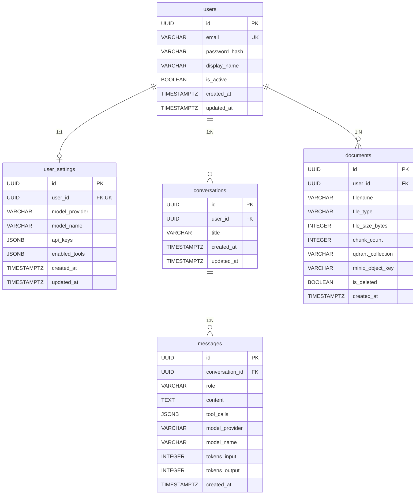

# JARVIS 数据库设计文档

## ER 关系图

## 表关系说明

| 关系 | 类型 | 说明 |
|------|------|------|
| users → user_settings | 1:1 | 每用户一行设置，UNIQUE 约束保证 |
| users → conversations | 1:N | 用户拥有多个对话 |
| users → documents | 1:N | 用户上传多个文档 |
| conversations → messages | 1:N | 对话包含多条消息 |

所有外键均设置 `ON DELETE CASCADE`，删除用户时自动清理关联数据。

## 索引策略

| 索引名 | 表 | 列 | 类型 | 说明 |
|--------|---|---|------|------|
| users.pkey | users | id | PRIMARY | UUID 主键 |
| users.email UNIQUE | users | email | UNIQUE | 登录查询 |
| uq_user_settings_user_id | user_settings | user_id | UNIQUE | 保证 1:1 |
| idx_conversations_user_id | conversations | user_id | B-tree | 按用户查对话列表 |
| idx_messages_conversation_id | messages | conversation_id | B-tree | 按对话查消息 |
| idx_messages_created_at | messages | created_at | B-tree | 按时间排序消息 |
| idx_documents_user_id | documents | user_id | B-tree | 按用户查文档 |
| idx_documents_is_deleted | documents | (user_id, is_deleted) | Partial (WHERE NOT is_deleted) | 过滤已删除文档 |

## Qdrant Collection 规范

- **命名**：`user_{user_id}`，每用户独立 Collection
- **向量维度**：1536（OpenAI text-embedding-ada-002 兼容）
- **距离函数**：Cosine
- **Payload 字段**：
  - `doc_id` (keyword)：关联 documents 表 UUID
  - `chunk_index` (integer)：文档切片序号
  - `text` (text)：切片原文
- Collection 按需创建（首次上传文档时），由 `ensure_user_collection()` 保证幂等

## MinIO Bucket 规范

- **Bucket 名称**：`jarvis-documents`
- **对象路径格式**：`{user_id}/{uuid}_{filename}`
- **版本控制**：关闭
- **初始化方式**：docker-compose `minio-init` 服务自动创建

## Redis Key 规范

详见 `database/redis/keyspace-design.md`。

## 容量预估（每用户基准）

| 资源 | 每用户预估 | 说明 |
|------|-----------|------|
| users 行 | 1 | - |
| user_settings 行 | 1 | - |
| conversations | ~50/月 | 活跃用户 |
| messages | ~500/月 | 每对话约 10 条 |
| documents | ~10 | 知识库文档 |
| Qdrant 向量 | ~1000 | 每文档约 100 个切片 |
| MinIO 存储 | ~50MB | 每文档约 5MB |
