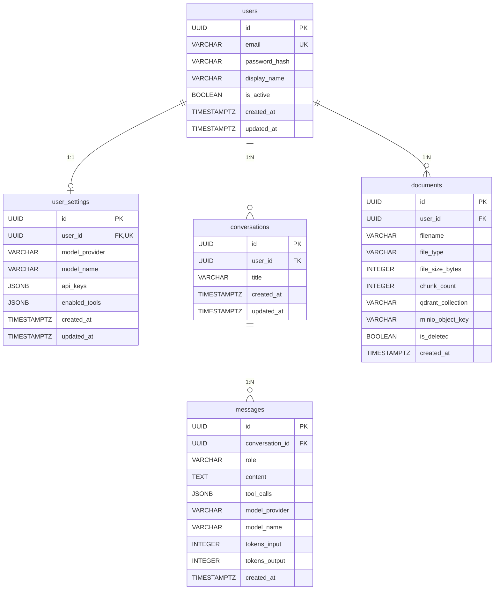

# 数据库设计文档化 & 基础设施初始化重构 Implementation Plan

> **For Claude:** REQUIRED SUB-SKILL: Use superpowers:executing-plans to implement this plan task-by-task.

**Goal:** 建立独立的 `database/` 目录管理所有存储组件的 DDL/配置，重构后端初始化逻辑，集成 Docker Compose 自动化。

**Architecture:** `database/` 目录作为设计真相源，包含 PostgreSQL DDL、Qdrant Collection 定义、MinIO Bucket 定义、Redis 配置。后端新增 `infra/` 模块统一管理基础设施客户端，FastAPI lifespan 中一次性初始化。Docker Compose 按各组件官方推荐方式挂载/初始化。

**Tech Stack:** PostgreSQL 18 + Alembic, Qdrant, MinIO + mc client, Redis, FastAPI lifespan, Docker Compose

---

### Task 1: 创建 PostgreSQL DDL 文件

**Files:**
- Create: `database/postgres/01_extensions.sql`
- Create: `database/postgres/02_users.sql`
- Create: `database/postgres/03_user_settings.sql`
- Create: `database/postgres/04_conversations.sql`
- Create: `database/postgres/05_messages.sql`
- Create: `database/postgres/06_documents.sql`
- Create: `database/postgres/07_indexes.sql`

**Step 1: 创建 01_extensions.sql**

```sql
-- 01_extensions.sql
-- PostgreSQL 扩展
CREATE EXTENSION IF NOT EXISTS pgcrypto;
```

**Step 2: 创建 02_users.sql**

```sql
-- 02_users.sql
-- 用户表：存储用户基本信息和认证数据
CREATE TABLE IF NOT EXISTS users (
    id              UUID PRIMARY KEY DEFAULT gen_random_uuid(),
    email           VARCHAR(255) NOT NULL UNIQUE,
    password_hash   VARCHAR(255) NOT NULL,
    display_name    VARCHAR(100),
    is_active       BOOLEAN NOT NULL DEFAULT TRUE,
    created_at      TIMESTAMPTZ NOT NULL DEFAULT NOW(),
    updated_at      TIMESTAMPTZ NOT NULL DEFAULT NOW()
);

COMMENT ON TABLE users IS '用户表：存储用户基本信息和认证数据';
COMMENT ON COLUMN users.id IS '主键，UUID v4';
COMMENT ON COLUMN users.email IS '邮箱地址，全局唯一，用于登录';
COMMENT ON COLUMN users.password_hash IS 'bcrypt 哈希后的密码';
COMMENT ON COLUMN users.display_name IS '显示名称，可选';
COMMENT ON COLUMN users.is_active IS '账户是否激活';
COMMENT ON COLUMN users.created_at IS '创建时间';
COMMENT ON COLUMN users.updated_at IS '最后更新时间';
```

**Step 3: 创建 03_user_settings.sql**

```sql
-- 03_user_settings.sql
-- 用户设置表：模型偏好、API Key（加密存储）、工具开关
CREATE TABLE IF NOT EXISTS user_settings (
    id              UUID PRIMARY KEY DEFAULT gen_random_uuid(),
    user_id         UUID NOT NULL REFERENCES users(id) ON DELETE CASCADE,
    model_provider  VARCHAR(50) NOT NULL DEFAULT 'deepseek',
    model_name      VARCHAR(100) NOT NULL DEFAULT 'deepseek-chat',
    api_keys        JSONB NOT NULL DEFAULT '{}',
    enabled_tools   JSONB NOT NULL DEFAULT '["search","code_exec","file","datetime"]',
    created_at      TIMESTAMPTZ NOT NULL DEFAULT NOW(),
    updated_at      TIMESTAMPTZ NOT NULL DEFAULT NOW(),
    CONSTRAINT uq_user_settings_user_id UNIQUE (user_id)
);

COMMENT ON TABLE user_settings IS '用户设置表：每用户一行，存储模型偏好和 API Key';
COMMENT ON COLUMN user_settings.model_provider IS 'LLM 提供商标识：deepseek / openai / anthropic';
COMMENT ON COLUMN user_settings.model_name IS '模型名称：deepseek-chat / gpt-4 / claude-3 等';
COMMENT ON COLUMN user_settings.api_keys IS 'Fernet 加密后的 API Key JSON，格式 {"provider": "encrypted_key"}';
COMMENT ON COLUMN user_settings.enabled_tools IS '已启用工具列表 JSON 数组';
```

**Step 4: 创建 04_conversations.sql**

```sql
-- 04_conversations.sql
-- 对话表：每条记录代表一个对话会话
CREATE TABLE IF NOT EXISTS conversations (
    id          UUID PRIMARY KEY DEFAULT gen_random_uuid(),
    user_id     UUID NOT NULL REFERENCES users(id) ON DELETE CASCADE,
    title       VARCHAR(255) NOT NULL DEFAULT 'New Conversation',
    created_at  TIMESTAMPTZ NOT NULL DEFAULT NOW(),
    updated_at  TIMESTAMPTZ NOT NULL DEFAULT NOW()
);

COMMENT ON TABLE conversations IS '对话表：每条记录代表一个对话会话';
COMMENT ON COLUMN conversations.user_id IS '所属用户 ID，级联删除';
COMMENT ON COLUMN conversations.title IS '对话标题，默认 New Conversation';
```

**Step 5: 创建 05_messages.sql**

```sql
-- 05_messages.sql
-- 消息表：存储对话中的每条消息
CREATE TABLE IF NOT EXISTS messages (
    id                  UUID PRIMARY KEY DEFAULT gen_random_uuid(),
    conversation_id     UUID NOT NULL REFERENCES conversations(id) ON DELETE CASCADE,
    role                VARCHAR(20) NOT NULL,
    content             TEXT NOT NULL,
    tool_calls          JSONB,
    model_provider      VARCHAR(50),
    model_name          VARCHAR(100),
    tokens_input        INTEGER,
    tokens_output       INTEGER,
    created_at          TIMESTAMPTZ NOT NULL DEFAULT NOW(),
    CONSTRAINT ck_messages_role CHECK (role IN ('human', 'ai', 'tool', 'system'))
);

COMMENT ON TABLE messages IS '消息表：存储对话中每条消息及 token 统计';
COMMENT ON COLUMN messages.role IS '角色：human（用户）/ ai（AI 回复）/ tool（工具结果）/ system（系统提示）';
COMMENT ON COLUMN messages.tool_calls IS '工具调用详情 JSON，仅 role=ai 时可能非空';
COMMENT ON COLUMN messages.tokens_input IS '输入 token 数，用于用量统计';
COMMENT ON COLUMN messages.tokens_output IS '输出 token 数，用于用量统计';
```

**Step 6: 创建 06_documents.sql**

```sql
-- 06_documents.sql
-- 文档表：用户上传的知识库文档元数据
CREATE TABLE IF NOT EXISTS documents (
    id                  UUID PRIMARY KEY DEFAULT gen_random_uuid(),
    user_id             UUID NOT NULL REFERENCES users(id) ON DELETE CASCADE,
    filename            VARCHAR(255) NOT NULL,
    file_type           VARCHAR(20) NOT NULL,
    file_size_bytes     INTEGER NOT NULL,
    chunk_count         INTEGER NOT NULL DEFAULT 0,
    qdrant_collection   VARCHAR(255) NOT NULL,
    minio_object_key    VARCHAR(500) NOT NULL,
    is_deleted          BOOLEAN NOT NULL DEFAULT FALSE,
    created_at          TIMESTAMPTZ NOT NULL DEFAULT NOW(),
    CONSTRAINT ck_documents_file_type CHECK (file_type IN ('pdf', 'txt', 'md', 'docx'))
);

COMMENT ON TABLE documents IS '文档表：用户上传的知识库文档元数据';
COMMENT ON COLUMN documents.qdrant_collection IS 'Qdrant 中对应的 Collection 名称，格式 user_{user_id}';
COMMENT ON COLUMN documents.minio_object_key IS 'MinIO 中的对象路径，格式 {user_id}/{uuid}_{filename}';
COMMENT ON COLUMN documents.is_deleted IS '软删除标记';
COMMENT ON COLUMN documents.chunk_count IS '文档切片数量，向量化后回填';
```

**Step 7: 创建 07_indexes.sql**

```sql
-- 07_indexes.sql
-- 非主键索引：加速常用查询
CREATE INDEX IF NOT EXISTS idx_conversations_user_id ON conversations(user_id);
CREATE INDEX IF NOT EXISTS idx_messages_conversation_id ON messages(conversation_id);
CREATE INDEX IF NOT EXISTS idx_messages_created_at ON messages(created_at);
CREATE INDEX IF NOT EXISTS idx_documents_user_id ON documents(user_id);
CREATE INDEX IF NOT EXISTS idx_documents_is_deleted ON documents(user_id, is_deleted) WHERE NOT is_deleted;
```

**Step 8: 提交**

```bash
git add database/postgres/
git commit -m "feat: add PostgreSQL DDL files with table comments"
```

---

### Task 2: 创建 Qdrant / MinIO / Redis 配置文件

**Files:**
- Create: `database/qdrant/collections.json`
- Create: `database/minio/buckets.json`
- Create: `database/redis/redis.conf`
- Create: `database/redis/keyspace-design.md`

**Step 1: 创建 collections.json**

```json
{
  "$schema": "自定义 Qdrant Collection 定义，供后端 lifespan 读取并创建",
  "collections": [
    {
      "name_pattern": "user_{user_id}",
      "description": "每用户独立 Collection，存储用户私有文档的向量嵌入",
      "vectors": {
        "size": 1536,
        "distance": "Cosine"
      },
      "payload_schema": {
        "doc_id": { "type": "keyword", "description": "关联 documents 表的 UUID" },
        "chunk_index": { "type": "integer", "description": "文档切片序号" },
        "text": { "type": "text", "description": "切片原文" }
      },
      "note": "Collection 按用户动态创建，不预建。此文件定义规范，由后端 ensure_collection() 读取参数。"
    }
  ]
}
```

**Step 2: 创建 buckets.json**

```json
{
  "$schema": "MinIO Bucket 定义，供 minio-init 容器和后端代码参考",
  "buckets": [
    {
      "name": "jarvis-documents",
      "description": "用户上传文档存储，对象路径格式 {user_id}/{uuid}_{filename}",
      "versioning": false,
      "lifecycle": null
    }
  ]
}
```

**Step 3: 创建 redis.conf**

```conf
# Redis 配置 - JARVIS 项目
# 参考：https://redis.io/docs/latest/operate/oss_and_stack/install/install-stack/docker/

# 持久化：启用 AOF + RDB 双保险
appendonly yes
appendfsync everysec
save 900 1
save 300 10
save 60 10000

# 内存限制（开发环境 256MB，生产按需调整）
maxmemory 256mb
maxmemory-policy allkeys-lru

# 安全：绑定所有接口（Docker 网络内部访问）
bind 0.0.0.0
protected-mode no
```

**Step 4: 创建 keyspace-design.md**

```markdown
# Redis Key 命名规范

## 命名格式

`jarvis:{domain}:{identifier}:{sub_key}`

## Key 清单

| Key 模式 | 数据结构 | TTL | 说明 |
|----------|---------|-----|------|
| `jarvis:session:{user_id}` | STRING (JSON) | 7d | 用户会话缓存 |
| `jarvis:rate:{user_id}:{endpoint}` | STRING (counter) | 1min | API 限流计数器（slowapi 自动管理） |
| `jarvis:chat:history:{conversation_id}` | LIST | 24h | 近期对话缓存，加速上下文加载 |

## 约定

- 所有 Key 以 `jarvis:` 开头，避免与其他服务冲突
- TTL 必须设置，禁止无过期 Key（防止内存泄漏）
- 生产环境通过环境变量覆盖 maxmemory
```

**Step 5: 提交**

```bash
git add database/qdrant/ database/minio/ database/redis/
git commit -m "feat: add Qdrant, MinIO, Redis configuration and design docs"
```

---

### Task 3: 创建 schema-design.md 全量设计文档

**Files:**
- Create: `database/design/schema-design.md`

**Step 1: 创建设计文档**

文档内容需包含：
- 各表 ER 关系图（Mermaid）
- 字段说明、类型、约束
- 索引策略说明
- Qdrant Collection 规范
- MinIO Bucket 规范
- Redis Key 规范引用
- 容量预估（每用户基准）

ER 图使用 Mermaid 语法：



**Step 2: 提交**

```bash
git add database/design/
git commit -m "feat: add comprehensive schema design document with ER diagram"
```

---

### Task 4: 创建 database/README.md

**Files:**
- Create: `database/README.md`

**Step 1: 编写 README**

内容需包含：
- 目录结构说明
- 各组件初始化方式（PostgreSQL: docker-entrypoint-initdb.d / Qdrant: 后端 lifespan / MinIO: mc init 容器 / Redis: 配置挂载）
- 全新部署 vs 增量迁移的流程
- DDL 与 Alembic 的关系说明
- 新增表/改字段的标准操作流程

**Step 2: 提交**

```bash
git add database/README.md
git commit -m "feat: add database directory README with maintenance guide"
```

---

### Task 5: 创建后端 infra 模块 - Qdrant 客户端

**Files:**
- Create: `backend/app/infra/__init__.py`
- Create: `backend/app/infra/qdrant.py`
- Create: `backend/tests/infra/__init__.py`
- Create: `backend/tests/infra/test_qdrant.py`

**Step 1: 编写测试 test_qdrant.py**

```python
import json
from pathlib import Path
from unittest.mock import AsyncMock, patch

import pytest

from app.infra.qdrant import get_qdrant_client, ensure_user_collection


def test_collections_json_is_valid():
    """database/qdrant/collections.json 应可被解析。"""
    path = Path(__file__).resolve().parents[3] / "database" / "qdrant" / "collections.json"
    data = json.loads(path.read_text())
    assert "collections" in data
    coll = data["collections"][0]
    assert coll["vectors"]["size"] == 1536
    assert coll["vectors"]["distance"] == "Cosine"


@pytest.mark.anyio
async def test_ensure_user_collection_creates_when_missing():
    """当 collection 不存在时应创建。"""
    mock_client = AsyncMock()
    mock_client.collection_exists.return_value = False

    with patch("app.infra.qdrant.get_qdrant_client", return_value=mock_client):
        await ensure_user_collection("test-user-id")

    mock_client.create_collection.assert_called_once()


@pytest.mark.anyio
async def test_ensure_user_collection_skips_when_exists():
    """当 collection 已存在时不应重复创建。"""
    mock_client = AsyncMock()
    mock_client.collection_exists.return_value = True

    with patch("app.infra.qdrant.get_qdrant_client", return_value=mock_client):
        await ensure_user_collection("test-user-id")

    mock_client.create_collection.assert_not_called()
```

**Step 2: 运行测试确认失败**

```bash
cd backend && uv run pytest tests/infra/test_qdrant.py -v
```

Expected: FAIL (module not found)

**Step 3: 实现 infra/qdrant.py**

```python
import json
from functools import lru_cache
from pathlib import Path

from qdrant_client import AsyncQdrantClient
from qdrant_client.models import Distance, VectorParams

from app.core.config import settings

_COLLECTIONS_JSON = Path(__file__).resolve().parents[2] / "database" / "qdrant" / "collections.json"


@lru_cache
def _load_vector_config() -> dict:
    """从 database/qdrant/collections.json 读取向量配置。"""
    if _COLLECTIONS_JSON.exists():
        data = json.loads(_COLLECTIONS_JSON.read_text())
        return data["collections"][0]["vectors"]
    return {"size": 1536, "distance": "Cosine"}


def get_qdrant_client() -> AsyncQdrantClient:
    return AsyncQdrantClient(url=settings.qdrant_url)


async def ensure_user_collection(user_id: str) -> None:
    """确保用户的 Qdrant Collection 存在（幂等）。"""
    client = get_qdrant_client()
    collection_name = f"user_{user_id}"
    exists = await client.collection_exists(collection_name)
    if not exists:
        vec_cfg = _load_vector_config()
        distance = getattr(Distance, vec_cfg["distance"].upper(), Distance.COSINE)
        await client.create_collection(
            collection_name=collection_name,
            vectors_config=VectorParams(size=vec_cfg["size"], distance=distance),
        )
```

`backend/app/infra/__init__.py`:

```python
```

**Step 4: 运行测试确认通过**

```bash
cd backend && uv run pytest tests/infra/test_qdrant.py -v
```

Expected: PASS

**Step 5: 提交**

```bash
git add backend/app/infra/ backend/tests/infra/
git commit -m "feat: add infra/qdrant module with ensure_user_collection"
```

---

### Task 6: 创建后端 infra 模块 - MinIO 客户端

**Files:**
- Create: `backend/app/infra/minio.py`
- Create: `backend/tests/infra/test_minio.py`

**Step 1: 编写测试 test_minio.py**

```python
from app.infra.minio import get_minio_client


def test_get_minio_client_returns_client():
    """get_minio_client 应返回有效的 Minio 实例。"""
    client = get_minio_client()
    assert client is not None
    assert hasattr(client, "put_object")
    assert hasattr(client, "bucket_exists")
```

**Step 2: 运行测试确认失败**

```bash
cd backend && uv run pytest tests/infra/test_minio.py -v
```

Expected: FAIL

**Step 3: 实现 infra/minio.py**

```python
from minio import Minio

from app.core.config import settings


def get_minio_client() -> Minio:
    return Minio(
        settings.minio_endpoint,
        access_key=settings.minio_access_key,
        secret_key=settings.minio_secret_key,
        secure=False,
    )
```

**Step 4: 运行测试确认通过**

```bash
cd backend && uv run pytest tests/infra/test_minio.py -v
```

Expected: PASS

**Step 5: 提交**

```bash
git add backend/app/infra/minio.py backend/tests/infra/test_minio.py
git commit -m "feat: add infra/minio module"
```

---

### Task 7: 创建后端 infra 模块 - Redis 客户端

**Files:**
- Create: `backend/app/infra/redis.py`
- Create: `backend/tests/infra/test_redis.py`

**Step 1: 编写测试 test_redis.py**

```python
from app.infra.redis import get_redis_url


def test_get_redis_url_returns_configured_url():
    """应返回配置中的 Redis URL。"""
    url = get_redis_url()
    assert url.startswith("redis://")
```

**Step 2: 运行测试确认失败**

```bash
cd backend && uv run pytest tests/infra/test_redis.py -v
```

Expected: FAIL

**Step 3: 实现 infra/redis.py**

```python
from app.core.config import settings


def get_redis_url() -> str:
    return settings.redis_url
```

**Step 4: 运行测试确认通过**

```bash
cd backend && uv run pytest tests/infra/test_redis.py -v
```

Expected: PASS

**Step 5: 提交**

```bash
git add backend/app/infra/redis.py backend/tests/infra/test_redis.py
git commit -m "feat: add infra/redis module"
```

---

### Task 8: 重构 rag/indexer.py — 使用 infra 模块

**Files:**
- Modify: `backend/app/rag/indexer.py`

**Step 1: 运行现有测试确认基线**

```bash
cd backend && uv run pytest tests/rag/ -v
```

**Step 2: 重构 indexer.py**

将 `index_document` 中内联的 collection 检查/创建逻辑替换为 `infra.qdrant`：

```python
import uuid

from qdrant_client.models import PointStruct

from app.infra.qdrant import ensure_user_collection, get_qdrant_client
from app.rag.chunker import chunk_text
from app.rag.embedder import get_embedder


async def index_document(user_id: str, doc_id: str, text: str, api_key: str) -> int:
    await ensure_user_collection(user_id)
    client = get_qdrant_client()
    collection = f"user_{user_id}"

    chunks = chunk_text(text)
    embedder = get_embedder(api_key)
    vectors = await embedder.aembed_documents(chunks)

    points = [
        PointStruct(
            id=str(uuid.uuid4()),
            vector=vec,
            payload={"doc_id": doc_id, "chunk_index": i, "text": chunk},
        )
        for i, (chunk, vec) in enumerate(zip(chunks, vectors, strict=True))
    ]
    await client.upsert(collection_name=collection, points=points)
    return len(chunks)


async def search_documents(
    user_id: str, query: str, api_key: str, top_k: int = 5
) -> list[str]:
    client = get_qdrant_client()
    collection = f"user_{user_id}"
    embedder = get_embedder(api_key)
    query_vec = await embedder.aembed_query(query)
    results = await client.search(
        collection_name=collection, query_vector=query_vec, limit=top_k
    )
    return [r.payload["text"] for r in results if r.payload]
```

**Step 3: 运行测试确认通过**

```bash
cd backend && uv run pytest tests/rag/ -v
```

**Step 4: 提交**

```bash
git add backend/app/rag/indexer.py
git commit -m "refactor: use infra/qdrant in rag/indexer, remove inline collection creation"
```

---

### Task 9: 重构 api/documents.py — 使用 infra 模块

**Files:**
- Modify: `backend/app/api/documents.py`

**Step 1: 运行现有测试确认基线**

```bash
cd backend && uv run pytest tests/ -v
```

**Step 2: 重构 documents.py**

删除 `_get_minio_client()` 和内联 bucket 检查，替换为 `infra.minio`：

```python
import asyncio
import io
import uuid
from pathlib import Path

from fastapi import APIRouter, Depends, File, HTTPException, UploadFile
from sqlalchemy import select
from sqlalchemy.ext.asyncio import AsyncSession

from app.api.deps import get_current_user
from app.core.config import settings
from app.core.security import decrypt_api_keys
from app.db.models import Document, User, UserSettings
from app.db.session import get_db
from app.infra.minio import get_minio_client
from app.rag.indexer import index_document

router = APIRouter(prefix="/api/documents", tags=["documents"])

ALLOWED_TYPES = {"pdf", "txt", "md", "docx"}
MAX_SIZE = 50 * 1024 * 1024


def extract_text(content: bytes, file_type: str) -> str:
    if file_type in ("txt", "md"):
        return content.decode("utf-8", errors="ignore")
    if file_type == "pdf":
        import pypdf

        reader = pypdf.PdfReader(io.BytesIO(content))
        return "\n".join(p.extract_text() or "" for p in reader.pages)
    if file_type == "docx":
        import docx

        doc = docx.Document(io.BytesIO(content))
        return "\n".join(p.text for p in doc.paragraphs)
    return ""


@router.post("", status_code=201)
async def upload_document(
    file: UploadFile = File(...),
    user: User = Depends(get_current_user),
    db: AsyncSession = Depends(get_db),
):
    ext = (file.filename or "").rsplit(".", 1)[-1].lower()
    if ext not in ALLOWED_TYPES:
        raise HTTPException(status_code=400, detail=f"File type .{ext} not supported")

    content = await file.read()
    if len(content) > MAX_SIZE:
        raise HTTPException(status_code=400, detail="File exceeds 50MB limit")

    safe_name = Path(file.filename or "upload").name
    object_key = f"{user.id}/{uuid.uuid4()}_{safe_name}"

    minio_client = get_minio_client()
    await asyncio.to_thread(
        minio_client.put_object,
        settings.minio_bucket,
        object_key,
        io.BytesIO(content),
        len(content),
    )

    user_settings = await db.scalar(
        select(UserSettings).where(UserSettings.user_id == user.id)
    )
    provider = user_settings.model_provider if user_settings else "deepseek"
    raw_keys = user_settings.api_keys if user_settings else {}
    api_key = decrypt_api_keys(raw_keys).get(provider, "")

    text = extract_text(content, ext)
    doc = Document(
        user_id=user.id,
        filename=safe_name,
        file_type=ext,
        file_size_bytes=len(content),
        qdrant_collection=f"user_{user.id}",
        minio_object_key=object_key,
    )
    db.add(doc)
    await db.flush()
    chunk_count = await index_document(str(user.id), str(doc.id), text, api_key)
    doc.chunk_count = chunk_count
    await db.commit()
    return {"id": str(doc.id), "filename": doc.filename, "chunk_count": chunk_count}
```

**Step 3: 运行测试确认通过**

```bash
cd backend && uv run pytest tests/ -v
```

**Step 4: 提交**

```bash
git add backend/app/api/documents.py
git commit -m "refactor: use infra/minio in documents API, remove inline bucket check"
```

---

### Task 10: 添加 FastAPI lifespan 初始化

**Files:**
- Modify: `backend/app/main.py`

**Step 1: 运行现有测试确认基线**

```bash
cd backend && uv run pytest tests/ -v
```

**Step 2: 添加 lifespan 到 main.py**

```python
import logging
from collections.abc import AsyncIterator
from contextlib import asynccontextmanager

from fastapi import FastAPI
from fastapi.middleware.cors import CORSMiddleware
from slowapi import _rate_limit_exceeded_handler
from slowapi.errors import RateLimitExceeded

from app.api.auth import router as auth_router
from app.api.chat import router as chat_router
from app.api.conversations import router as conversations_router
from app.api.documents import router as documents_router
from app.api.settings import router as settings_router
from app.core.config import settings
from app.core.limiter import limiter

logger = logging.getLogger(__name__)


@asynccontextmanager
async def lifespan(app: FastAPI) -> AsyncIterator[None]:
    """应用启动/关闭生命周期：初始化外部基础设施。"""
    # --- startup ---
    logger.info("Initializing infrastructure connections...")
    # Qdrant: 用户 collection 按需创建（ensure_user_collection 在业务层调用）
    # MinIO: bucket 由 docker-compose minio-init 服务创建
    # Redis: 由 slowapi/limiter 自行管理连接
    logger.info("Infrastructure ready.")
    yield
    # --- shutdown ---
    logger.info("Shutting down.")


app = FastAPI(title="Jarvis API", version="0.1.0", lifespan=lifespan)
app.state.limiter = limiter
app.add_exception_handler(RateLimitExceeded, _rate_limit_exceeded_handler)

app.add_middleware(
    CORSMiddleware,
    allow_origins=settings.cors_origins,
    allow_credentials=True,
    allow_methods=["*"],
    allow_headers=["*"],
)

app.include_router(auth_router)
app.include_router(conversations_router)
app.include_router(chat_router)
app.include_router(documents_router)
app.include_router(settings_router)


@app.get("/health")
async def health() -> dict[str, str]:
    return {"status": "ok"}
```

**Step 3: 运行全部测试**

```bash
cd backend && uv run pytest tests/ -v
```

**Step 4: 提交**

```bash
git add backend/app/main.py
git commit -m "feat: add FastAPI lifespan for infrastructure initialization"
```

---

### Task 11: 更新 docker-compose.yml

**Files:**
- Modify: `docker-compose.yml`

**Step 1: 修改 docker-compose.yml**

PostgreSQL 服务新增 init 脚本挂载：
```yaml
postgres:
  volumes:
    - ${HOME}/jarvis-data/postgres:/var/lib/postgresql/18/docker
    - ./database/postgres:/docker-entrypoint-initdb.d:ro
```

Redis 服务新增配置挂载和命令：
```yaml
redis:
  volumes:
    - ${HOME}/jarvis-data/redis:/data
    - ./database/redis/redis.conf:/usr/local/etc/redis/redis.conf:ro
  command: redis-server /usr/local/etc/redis/redis.conf
```

新增 minio-init 服务：
```yaml
minio-init:
  image: quay.io/minio/mc:latest
  depends_on:
    minio:
      condition: service_healthy
  restart: "no"
  environment:
    MINIO_ROOT_USER: ${MINIO_ROOT_USER}
    MINIO_ROOT_PASSWORD: ${MINIO_ROOT_PASSWORD}
  entrypoint: >
    /bin/sh -c "
    mc alias set jarvis http://minio:9000 $$MINIO_ROOT_USER $$MINIO_ROOT_PASSWORD;
    mc mb --ignore-existing jarvis/jarvis-documents;
    exit 0;
    "
```

**Step 2: 验证 compose 配置有效**

```bash
docker compose config --quiet
```

Expected: 无报错

**Step 3: 提交**

```bash
git add docker-compose.yml
git commit -m "feat: integrate database/ init scripts into docker-compose"
```

---

### Task 12: 最终集成验证

**Step 1: 运行全部后端测试**

```bash
cd backend && uv run pytest tests/ -v
```

Expected: 全部 PASS

**Step 2: 运行代码质量检查**

```bash
ruff check && ruff format --check && pyright
```

Expected: 无报错

**Step 3: 验证 docker-compose 配置**

```bash
docker compose config --quiet
```

Expected: 无报错

**Step 4: 最终提交（如有遗漏修复）**

```bash
git add -A
git commit -m "chore: final integration fixes"
```
